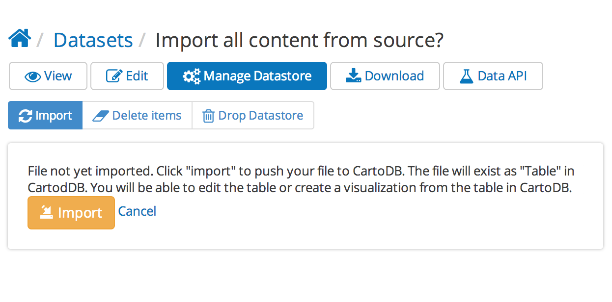

# DKAN Datastore CartoDB Integration

This module extends the DKAN Datastore to provide CartoDB integration.

When enabled the "Datastore" functionality is completely offloaded to CartoDB.

Files are uploaded to DKAN and posted to CartodB and stored as tables.

The CartoDB SQL API is made available for querying instead of the native DKAN Datastore API.

## Installation

This module requires the [CartoDB PHP library](https://github.com/Nucivic/cartodbclient-php). It should be downloaded and placed in ``sites/all/libraries``. The ``cartodb.class.php`` file should be located at ``sites/all/libraries/cartodbclient-php/cartodb.class.php``

You can also use the dkan\_datastore\_cartodb.make file: ``drush make --no-core dkan_datastore_cartodb.make``

See [the Drupal documentation](https://www.drupal.org/documentation/install/modules-themes) for general instructions on installing modules. Once the module is enabled, go to /admin/dkan/cartodb. Here you will enter your CartoDB credentials:

Once you’ve saved your credentials you should see “Successfully connected to CartoDB.”

## Publishing maps with CartoDB and DKAN

This module takes resources in [DKAN](https://github.com/NuCivic/dkan) and makes them editable in [CartoDB](http://cartodb.com/). The resulting visualizations can be displayed as previews for DKAN resources as well as to tell stories about your data elsewhere on your DKAN site.

CartoDB’s visualizations are built on a powerful [SQL API](http://docs.cartodb.com/cartodb-platform/sql-api.html). Once resources are added to CartoDB, their contents can also be queried. This allows users to make applications from your data.

### Add a resource

Next, add a resource with a file attached to it:

Once the resource has been uploaded, click “Manage Datastore”:

Click “Import” to start the process:

When the uploading has finished, the “Data API” tab will now indicate that users can query the contents of your file:

### Visualizing data from CartoDB

Now that your resource has been added to CartoDB, it can be queried through CartoDB’s SQL API. It can also still be previewed by DKAN’s native [Recline](http://okfnlabs.org/recline/) data preview.

CartoDB’s tools allow you to take your data and make rich interactive maps. To do so, go to CartoDB and create a visualization using your data. See [CartoDB’s Editor documentation](http://docs.cartodb.com/cartodb-editor.html) for details.

Once a visualization has been created in CartoDB, it is available as the data preview for the resource.

To access it click “Manage Datastore” once more. You should see a list of available visualizations:

Once you have selected a visualization to represent a resource it will be displayed on the resource itself:

